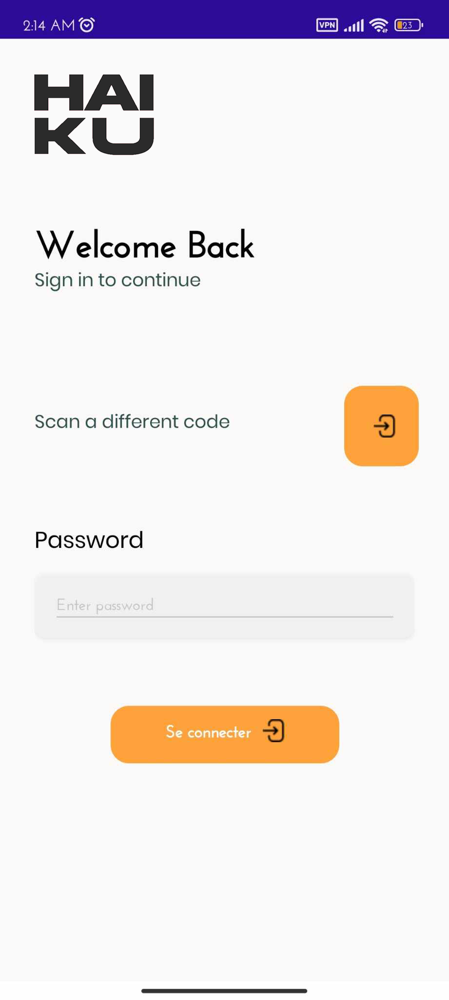

# Haiku Inventory Management App - Simplify your inventory management processes

Welcome to Haiku Inventory Management App, your solution for efficient inventory management! 📦📊

## About

Haiku Inventory Management App is a complete inventory management platform built with .NET MAUI. Our app is designed to help businesses streamline their inventory management processes, track inventory levels, and optimize inventory management. Whether you are a small business or a large enterprise, Haiku Inventory Management App provides the tools and features you need to stay organized and make informed inventory decisions.

## Key Features

- **Inventory Tracking:** Track your inventory levels, including quantities on hand.
- **Product Management:** Easily add, update and delete products from your inventory, including details like SKU, description and pricing.
- **Easy Inventory Scanner** Easily count inventory items using a built-in barcode and QR code scanner.
- **Intuitive User Interface:** Enjoy a user-friendly interface that simplifies inventory management tasks and improves productivity.

## How to use it

Using the Haiku inventory management app is simple:

1. Download and install the Haiku inventory management app on your device.
2. Launch the app and log in with your credentials or create a new account if you are a new user.
3. Set up your inventory by adding your products, including details like SKU, description, and pricing.
4. Start tracking your inventory by recording product quantities, locations, and availability.

### Technologies used

- [.NET MAUI](https://dotnet.maui.net/) : A cross-platform framework for creating native user interfaces.
- C#: A general-purpose programming language for developing .NET applications.

Thank you for your support and dedication. Happy inventory management! 📦
